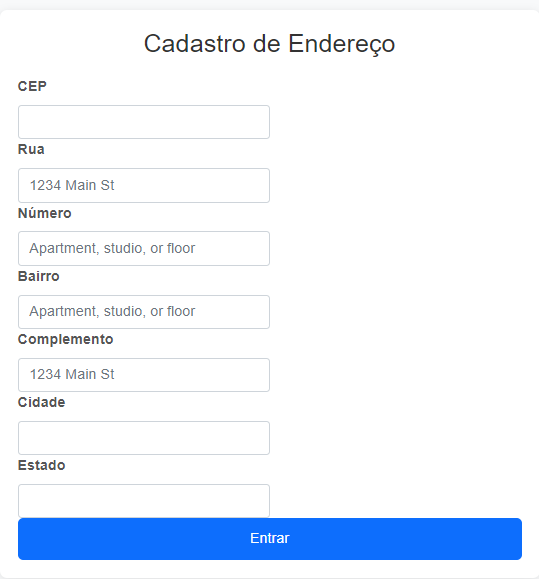
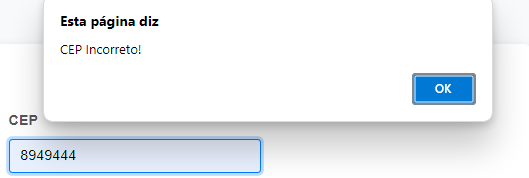

<h1 align = "center"

Formulário de cadastro de endereço

># License
>  

>
## Descrição do Projeto
Este projeto foi desenvolvido na aula de PWI (Porgramação Web 1). O obejtivo do projeto foi aprender a funçaõ de  limpar formulário e preencher formulário.

>
><h2>Caso o usuário digitar algum cep inválido ou incorreto, aparecerá esse alert<h2>

## Função do Projeto
A função do projeto é o usuário se cadastrar com seus dados de endereço de forma válida e correta.

# Funções utilizadas:🛠️

>* ``assync``
>essas funções podem realizar operações que demoram algum tempo, sem bloquear a execução do programa. É uma forma de escrever funções que podem fazer várias coisas ao mesmo tempo, sem travar o programa
>* ``await``
> faz a execução de uma função async pausar, para esperar pelo retorno da Promise , e resume a execução da função async quando o valor da Promise é resolvido.
>* ``fetch``
>* ``json``
>* ``addres``
>* ``hasOwnProperty``
>* ``addEventListener``

## 🔗 Referências
https://viacep.com.br/ 